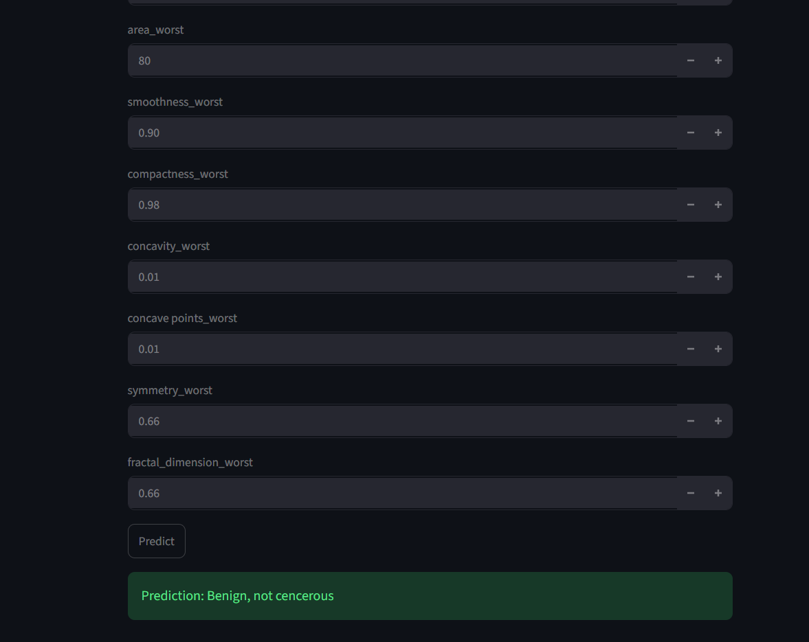

# 🩺 Breast Cancer Detection using Logistic Regression

## 📌 Project Overview

This project is a machine learning application that predicts whether a breast tumor is **Benign (Non-Cancerous)** or **Malignant (Cancerous)** using the **Logistic Regression** algorithm. The model is trained on a breast cancer dataset containing diagnostic features extracted from digitized images of breast cell nuclei.

The application is deployed with **Streamlit**, providing an interactive web interface where users can enter medical feature values and receive an instant prediction.

---

## 🚀 Features

* Predicts whether a breast tumor is **Benign** or **Malignant**
* Built using the **Logistic Regression** algorithm
* User-friendly interface with **Streamlit**
* Fast and accurate predictions
* Model saved using **Pickle** for deployment
* Simple and lightweight implementation

---

## 🛠️ Technologies Used

* Python
* Pandas
* NumPy
* Scikit-learn
* Streamlit
* Pickle

---

## 📂 Dataset

The project uses the **Breast Cancer Wisconsin Diagnostic Dataset**, which contains features computed from digitized images of fine needle aspirate (FNA) of breast masses.

Some important features include:

* Radius
* Texture
* Perimeter
* Area
* Smoothness
* Compactness
* Concavity
* Symmetry
* Fractal Dimension

The target variable consists of:

* **0 → Malignant**
* **1 → Benign**

---

## 🤖 Machine Learning Model

The model is built using **Logistic Regression**, a supervised machine learning algorithm commonly used for binary classification problems.

### Workflow

1. Load the dataset
2. Data preprocessing
3. Feature selection
4. Train-test split
5. Feature scaling
6. Train the Logistic Regression model
7. Evaluate model performance
8. Save the trained model
9. Deploy using Streamlit

---

## 📊 Model Evaluation

The model is evaluated using:

* Accuracy Score
* Confusion Matrix
* Precision
* Recall
* F1 Score

---

## ▶️ Installation

Clone the repository:

```bash
git clone https://github.com/your-username/breast-cancer-detection.git
```

Navigate to the project folder:

```bash
cd breast-cancer-detection
```

Install the required packages:

```bash
pip install -r requirements.txt
```

Run the Streamlit application:

```bash
streamlit run app.py
```

---

## 📁 Project Structure

```text
breast-cancer-detection/
│── app.py
│── breast_cancer_model.pkl
│── scaler.pkl
│── requirements.txt
│── README.md
│── notebook.ipynb
│── dataset.csv
```

---

## 📷 Application



The Streamlit application allows users to enter diagnostic measurements and instantly predicts whether the tumor is **Benign** or **Malignant**.

---

## 📌 Future Improvements

* Support additional machine learning models
* Hyperparameter tuning for improved performance
* Model comparison dashboard
* Feature importance visualization
* Cloud deployment with Streamlit Community Cloud

---

## ⚠️ Disclaimer

This project is intended for **educational and research purposes only**. The predictions generated by the model should **not** be considered a medical diagnosis or used as a substitute for professional medical advice. Always consult qualified healthcare professionals for clinical decisions.

---

## 👨‍💻 Author

**Yashpal**

If you found this project useful, consider giving it a ⭐ on GitHub!
